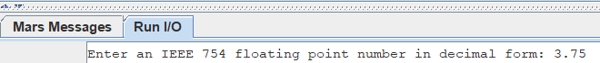
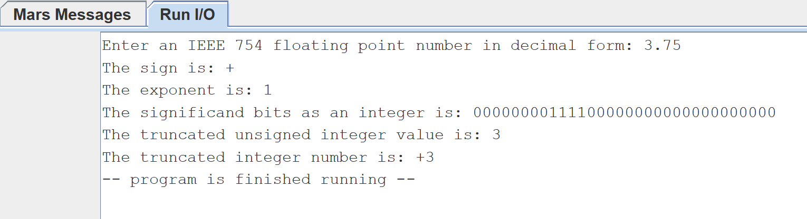
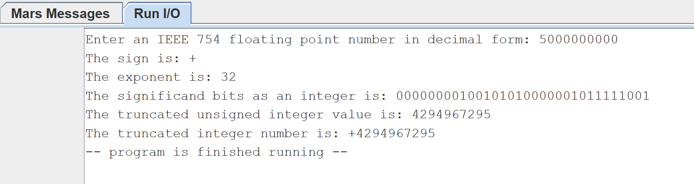
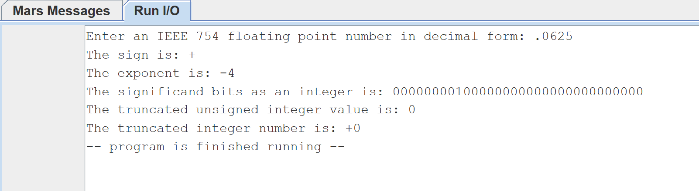

# Module 4 Challenge Activity: MIPS Procedures

- [Module 4 Challenge Activity: MIPS Procedures](#module-4-challenge-activity-mips-procedures)
	- [Learning Activities](#learning-activities)
	- [Purpose](#purpose)
	- [Skills and Knowledge](#skills-and-knowledge)
	- [Overview](#overview)
	- [Task 1: Ask user for Input](#task-1-ask-user-for-input)
		- [Sample Output Task 1](#sample-output-task-1)
	- [Task 2: Parse the sign](#task-2-parse-the-sign)
	- [Task 3: Parse the exponent](#task-3-parse-the-exponent)
	- [Task 4: Parse the significand](#task-4-parse-the-significand)
	- [Task 5: Calculate the integer representation](#task-5-calculate-the-integer-representation)
	- [Task 6: Print out results](#print-out-results)
	- [Sample Output](#sample-output)
	- [Test it in main](#test-it-in-main)
	- [Submission Checklist](#submission-checklist)

## Learning Activities

The learning activities related to this assignment are in the `la` folder of this
project. If you need to review the concepts, follow the [LA description](la/README.md)

## Purpose

The purpose of this assignment is to give you practice working with floating point
numbers in MIPS and continue practicing MIPS procedures or functions.

## Skills and Knowledge

By the end of this assignment, you should feel comfortable:

1. Moving floating point values to and from floating point registers
2. Doing logical operation on registers
3. Use of MIPS Procedures
4. Working with multiple files
5. Interpreting the IEEE 754 representation of floating point numbers

## Overview

For this challenge activity you will be writing a program the asks the user to
enter a decimal number and stores it in IEEE 754 single-precision floating point
representation.  You will then parse the IEEE 754 representation to extract the
different pieces (sign, exponent, and significand).  Finally, you will print the
truncated integer representation of the entered value.  

You do not have to convert the input to IEEE 754 representation manually.  Just use
the syscall to read a float.  This will automatically store the value in IEEE 754
format for you.  You can then copy the value to a normal 32-bit register to perform
the different bit manipulations to extract each piece.  

After the initial reading in of the floating point value and moving the value to a
standard register you should not use the floating point registers again.  Do not
use any of the floating point operations to find the sign, or truncate the value.
All of the parsing and calculations should be done using various bit manipulations
operations (i.e. bitshifts, maskings, etc).  Remember beyond the initial reading of
the floating point value and moving it to a standard register your program should
not touch the floating point registers again.

Your program does not need to handle any of the special cases of floating point
numbers like NaN, infinity, -infinity, 0 or -0.

## Task 1: Ask user for input

Your first task is to collect user input and store it in a register. First, prompt
the user to enter a floating point value as a decimal number. Then, store the input
value in a single precision floating point register.

Begin working in the file template (`ca.asm`) provided in the `ca` folder.

```mips
# Author:
# Date:
# Description:

.globl parse_sign, parse_exponent, parse_significand, calc_truncated_uint, main			# Do not remove this line

# Data for the program goes here
.data

prompt: .asciiz "Enter an IEEE 754 floating point number in decimal form: "


.text 				# Code goes here
main:

	# Step 1: Read a floating point number

	# Step 2: setup and call parse_sign

	# Step 3: setup and call parse_exponent

	# Step 4: setup and call parse_significand

	# Step 5: setup and call calc_truncated_uint

	# Step 6: If you haven't been printing values along the way
	# Print out the appropriate output here.

exit_main:
	li    $v0, 10		# 10 is the exit program syscall
	syscall			# execute call

## end of ca.asm
```

### Sample Output Task 1



## Task 2: Parse the sign

Your next task is to create a procedure called `parse_sign` that will extract and
interpret the sign bit of the IEEE 754 single precision floating point number. The
floating point number is the value you collected on [Task 1](#task-1-ask-user-for-input).
Your function will take the value as a 32-bit number in a non-floating
point register (i.e. `$a0`).  Remember, do not use floating point registers to
accomplish this task.  Instead you should use bit manipulations (i.e. shifting,
masking, etc) to determine the value of the sign bit.  If the sign bit is a 1 your
function should return the '-' character.  If it is a 0 your function should return
the '+' character.

The procedure should have the following signature:

```mips
###############################################################
# Gets the sign from an IEEE 754 single precision representation
#
# Argument parameters:
# $a0 - IEEE 754 single precision floating point number (required)
# Return Value:
# $v0 - ascii char for sign (+ or -) (required)
parse_sign:
	...
end_parse_sign:
	jr    $ra
```

Remember, the sign bit in an IEEE 754 floating point number is the most significant bit.

## Task 3: Parse the exponent

Your next task is to create a procedure called `parse_exponent` that will extract
and interpret the exponent bits of the IEEE 754 single precision floating point
number. The floating point number is the value you collected on [Task 1](#task-1-ask-user-for-input).
Your function will take the value as a 32-bit number in a non-floating point
register (i.e. `$a0`).  Next it will need to isolate the bits representing the
exponent and interpret those bits as an unsigned integer.  Finally, you will need
to subtract the bias to recover the true exponent value as a signed integer. This
is the value that should be returned.

The procedure should have the following signature:

```mips
###############################################################
# Gets the exponent from an IEEE 754 single precision representation
#
# Argument parameters:
# $a0 - IEEE 754 single precision floating point number
# Return Value:
# $v0 - signed integer of exponent value with bias removed
parse_exponent:
	...
end_parse_exponent:
        jr $ra
```

Remember the exponent is the 8 bits immediately following the sign bit.

## Task 4: Parse the significand

Your next task is to create a procedure called `parse_significand` that will
extract the mantissa of the IEEE 754 single precision floating point number and add
the implied 1. The floating point number is the value you collected on [Task 1](#task-1-ask-user-for-input).
Your function will take the value as a 32-bit number in a non-floating point
register (i.e. `$a0`).  Next it will need to isolate the bits representing the
mantissa.  Finally, you will need to insert a 1 as the most significant bit (i.e.
bit 24). This is the value that should be returned.

The procedure should have the following signature:

```mips
###############################################################
# Gets the significand from an IEEE 754 single precision representation
#
# Argument parameters:
# $a0 - IEEE 754 single precision floating point number
# Return Value:
# $v0 - unsigned int whose low order 24 bits represent the significand of the IEEE 754 number
parse_significand:
	...
end_parse_significand:
        jr $ra

```

Remember the mantissa is the low order 23 bits and you will need to add the implied 1.


## Task 5: Calculate the integer representation

Your next task is to create a procedure called `calc_truncated_uint` that will
calculate just the integer portion of the IEEE 754 single precision floating point
number given the exponent and significand. The exponent and significand will be in
the should be the same format as the expected return values from the corresponding
`parse_*` methods, [Task 3](#task-3-parse-the-exponent) and [Task 4](#task-4-parse-the-significand).

Your function will take the value of the exponent in register `$a0` and the value
of the significand in register `$a1`.  Next, based on the exponent it will
determine how many bits and in what direction to shift the significand.  After
performing the shift the result will be the truncated unsigned integer
representation of the floating point number.  This is the value that should be
returned.

The procedure should have the following signature:

```mips
###############################################################
# Calculates the truncated unsigned int representation of an
# IEEE 754 single precision floating point number based on the
# unbiased exponent and the significand
#
# Argument parameters:
# $a0 - singed integer representing unbiased exponent of IEEE 754 single precision floating point number
# $a1 - unsigned int whose low order 24 bits match the significand of the IEEE 754 number
calc_truncated_uint:
	...
end_calc_truncated_uint:
	jr $ra
```

Remember that not all floating point values are representable as an unsigned integer. 
If the value is large enough to cause integer overflow (exponent is greater than 31), 
then use the max unsigned int value. If the value is between 0 and 1 (exponent is negative), 
the integer portion is just 0.

To find the integer portion, you have to shift the significand but beware. If you shift 
right to get the binary point in the correct place and then shift left based on the exponent, 
you will lose precision. If you shift left based on the exponent and then right to get 
the binary point in the correct place, you will lose significant digits. Instead, first 
compute the total number of shifts needed. Since the last 23 bits in the significand are 
after the binary point, it is like the number has already been shifted left 23 times. 
If the exponent is larger than 23, you will need to shift left more. If the exponent is less 
than 23 you will need to shift right.

## Task 6: Print the results

Your final task is to print the results.  You can do this my either printing output
as you go along, or keeping the results and printing everything at the end.  Even
if you print as you go, you will still need to keep certain pieces of information
to calculate the correct result and produce the correct output.

You should print the following items
The sign (`'+'` or `'-'`) with a label  (Use `syscall 11` to print a single character)
The exponent as an integer with a label
The significand as a 32-bit bitstring with a label. (Use `syscall 35` to print a bitstring)
The truncated unsigned integer with a label. (Use `syscall 36` to print an unsigned integer)

Finally, you should put it all together and print the sign followed by the
truncated unsigned integer.

See the sample output below for examples.

### Sample Output

Standard Input



Overflow example



Underflow example



### Test it in main

Remember that `before` you call any procedure in `main`, make sure you set up the
parameters in the correct register (`$a0`, or `$a1`). Before returning from the
procedure the `$v0` register MUST have the return value from your procedure.

## Submission Checklist

- [ ] Save and `commit` my code in github desktop
- [ ] `Push` the code to github.com
- [ ] Uploaded video of code walk-through in `Canvas`
- [ ] Add your github repo as a comment to your assignment in `Canvas`.
